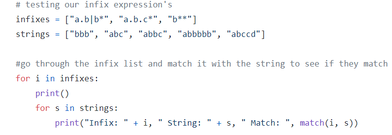
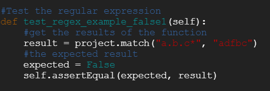
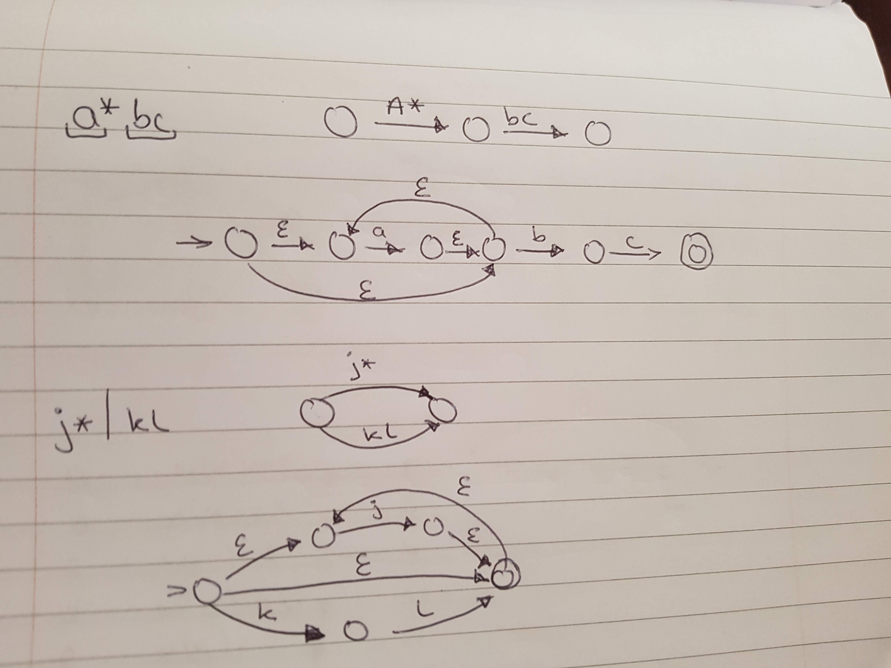
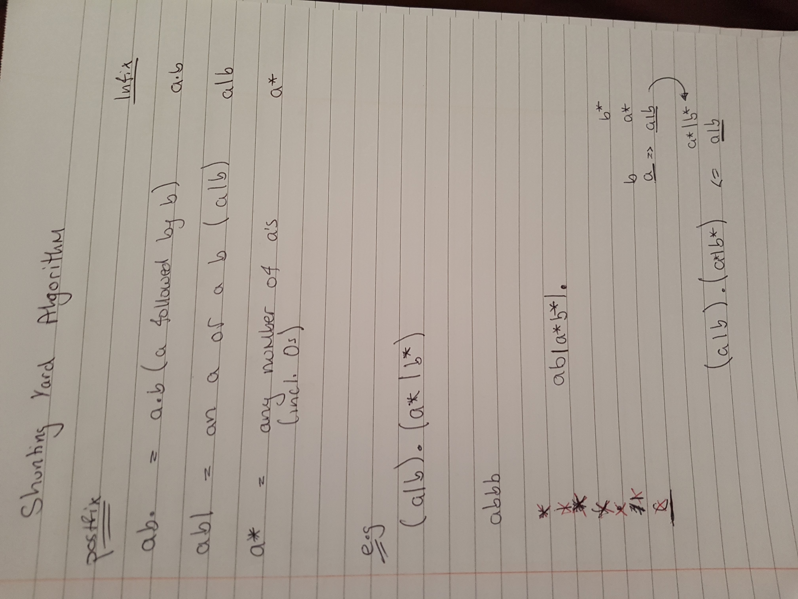

Introduction
-------------------------------------------------------------------------------------------------------------------------------

https://github.com/sagheerahmadGmit/GraphTheory  

The following project has a real-world problem that we may be asked to solve in our workplace or industry. We are not required to solve this problem from the top of our heads, but we should be able to research and investigate the different methods that we could apply to the problem to solve it. There are many solutions already available and this is one of them. One of the ways to solve this problem is to use Thompson’s Construction  
  

This repository demonstrates my understanding of Thompson’s Construction and contains a program that was developed for the module 'Graph Theory' in the 3rd year Software Development Course. The program is written in the Python programming language.  
  

The aim of the project was to write an application that will match the regular expression to Ken Thompsons' construction. It does this by taking an NFA infix and converting it to a postfix expression using the shunting algorithm. It will then match it with a given string to see if they match.  
  

The minimum requirement for the application was to accept a regular expression with the special characters ".", "|" and "*" and to match it against an input string. But it has also included the “+” and the “?” operators.  
 
The main parts of this program that we need to know are:  

1.	Regular expressions: are a notation for describing sets of character strings. The simplest regular expression is a single literal character. Except for the special metacharacters “*”, “+”, “?”, “()”, “|”, these characters match themselves. To match a metacharacter, escape it with a backslash: + matches a literal plus character.
2.	Thompsons construction: is an algorithm developed by Ken Thompson in 1968. The algorithm splits a regular expression into its smallest sub-expression. For every sub-expression, an NFA is created. All those NFAs are then put together into a single NFA which can be used to match a string. For more information on Thompson's Construction, please click [here](https://en.wikipedia.org/wiki/Thompson%27s_construction)
3.	NFAs: were introduced in 1959 by Michael O. Rabin and Dana Scott. They showed NFA's equivalence to DFAs. NFAs are used in the implementation of regular expressions: Thompson's construction is an algorithm for compiling a regular expression to an NFA that can efficiently perform pattern matching on strings. They can have any number of arrows for each state and symbol. The empty string E (epsilon) is also used to label arrows that are used to label arrows that are followed without reading a character from the input, while also remaining in the orginal state. NFAs will recognise the same language as the regular expression.

Structure
----------------------------------------------------------------------------------------------------------

There are 3 parts to this project:

1. Using the Shunting Yard Algorithm to change a regular expression from infix to postfix.
2. Create NFAs for each fragment in the regular expression and assemble them to a single NFA.
3. Match the infix with a string.

The Shunting yard algorithm is an algorthm that converts a infix regular expression to a postfix because its easier to use Thompsons' construction on a postfix regular expression.

Once the regular expression is converted into postfix, It is then converted into a non-deterministic finite automaton. This is done by popping off fragments of the stack and creating new start and accept state for each of the special operators.

The postfix expression is then matched against a string to see if the string matches the given postfix expression.

  
Run
-------------------------------------------------------------------------------------------------------

In order to run this program we need to make sure we have Python3 downloaded. Python is one of the biggest programming languages in the world and was used to create this application. To download Python3 you can either go to the official python website or you can click [here](https://www.python.org/downloads/) to download it.  
  
If you python3 downloaded then, simply clone this repository using the following command

```
git clone https://github.com/sagheerahmadGmit/GraphTheory
```

After cloning this repository, change to the project folder

```
cd GraphTheory
```

And finally run the program

```
python3 project.py
```

If you require more instructions on the program you can also run the following command

```
python3 projectCommandLine.py --help
```
  
When this program is run the user is presenetd with an option to either test their own regular expression or to exit the application. If the user chooses to test their own regular expression they will be asked to enter the infix expression and the string that will be compared.

Test
----------------------------------------------------------------------------------------------
To test if the program works, there were two approaches taken:

1. When the program is run, it shows the user some examples of the output and the infix and strings used. This was a hard coded version of the testing to see if 
the program does what it is intended to do. This was done by creating two different arrayLists and populating them with the infix and string values. 
A for loop is then setup to go through the arrayList and compare the infix to the string. The code can be seen in the image below.



2. The second way the testing was done, was by using unittest. 
	- Unittest is a unit testing framework that is very similar to Junit.
	- Unit Testing is a level of software testing where individual components of a software is tested. 
	  The purpose of this type of testing is to validate each unit of the program is working properly and 
	  does what it is intended to do. It usually has very few inputs and usually a single output. 
	  Because of this the testing can be more accurate.
	- The unittest class was imported at the top of the test.py class and was used to create a test case that was used to test the project.py class.
	- This way was a good idea because it tests each path of the code independently to any other part of the code.

To run the unittest tests, use the following command:

```
python3 test.py
```

This is an example of a unittest:



This is an example of the output from the first testing approach:

Infix: a.b|b* String: bbb Match: True  
Infix: a.b|b* String: abc Match: False  
  
Infix: a.b.c* String: bbb Match: False  
Infix: a.b.c* String: abc Match: True  
  
Infix: b** String: bbb Match: True  
Infix: b** String: abc Match: False  
  
Algorithm
-----------------------------------------------------------------------------------------
The main algorithms that were used in this application were:

### Thompson's Construction

Thompsons construction: This is the main algorithm used in this application and was developed by Ken Thompson in 1968 for coverting a postfix regular expression into a non-deterministic automaton. Thompsons Construction turns strings into executable code that recognise the pattern defined by the regular expression. That code then can be executed against other strings to see if they match. The changing of regular expression into NFAs is known as compiling. The algorithm splits a regular expression into its smallest sub-expression. For every sub-expression a NFA is created. 

 

### Shunting Yard Algorithm

Shunting Yard Algorithm: The shunt(infix) function is to convert the infix expression that is passed as a parameter to postfix. Before converting 
the expression into postfix, the infix is saved to a list and the precedence of the operators is set. For each character in the infix regular expression a while loop is executed.
The loop is executed one character at a time. Inside the while loop, the first thing that happens is that a character is popped off from the input.
Inside the while there are also a few if statements that have different conditions depending on whether the character read is a round bracket, 
a character or a previously declared special operator. For example if we have the infix Expression (a|b), the first character read will be the 
'(' so, '(' will be pushed to the stack that was declared at the start of the function. The next character to be read would be 'a', which is 
neither a round bracket or a special operator so it is just stored in postfix list declared at the top. The next character '|' which is a special operator 
is then read, it's precedence is checked and depending on the character, it gets pushed to the stack. The next character 'b' is the same as 'a' and gets stored
in the postfix list. And for the closing bracket the if statement pops the operator stack until it find an open bracket and it gets rid of the open bracket.
The postfix list is then converted to a string and the the postfix ends up looking like 'ab'. The infix regular expression is now ready for matching.



Research
---------------------------------------------------------------------------------------------
https://www.youtube.com/watch?v=RYNN-tb9WxI  
http://www.cs.may.ie/staff/jpower/Courses/Previous/parsing/node5.html  
Learning how to convert a regular expression to a NFA and then to a DFA.  
  
https://www.youtube.com/watch?v=Wz85Hiwi5MY  
https://en.wikipedia.org/wiki/Shunting-yard_algorithm  
Learning more about the shunting yard algorithm  
  
https://swtch.com/~rsc/regexp/regexp1.html  
https://cs.lmu.edu/~ray/notes/regex/  
http://tldp.org/LDP/Bash-Beginners-Guide/html/sect_04_01.html  
A little more insight on regular expressions  
  
https://www.geeksforgeeks.org/stack-set-2-infix-to-postfix/  
Learning how to change a Infix notation to Postfix  
  
https://en.wikipedia.org/wiki/Nondeterministic_finite_automaton  
Nondeterministic finite automaton  
  
https://regex101.com/  
Test your own regular expressions  
  
https://en.wikipedia.org/wiki/Thompson%27s_construction  
More information on Thompsons Construction  
  
https://www.youtube.com/watch?v=cdblJqEUDNo  
This was used to make the command line arguments
